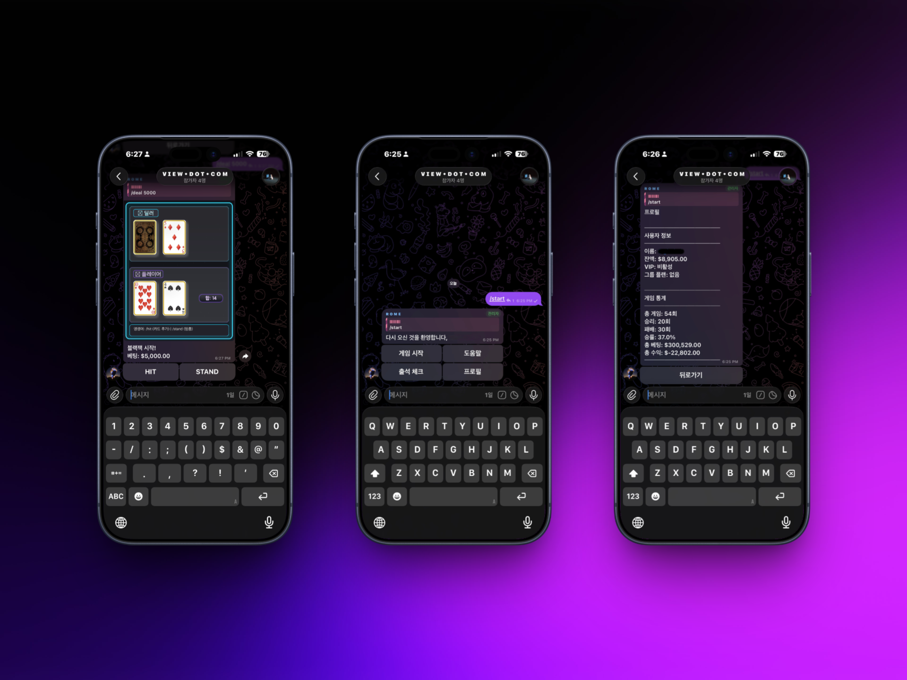

  
  <h1>Blackjack-py</h1>
  
A personal Blackjack bot for Telegram.

  

    
    
  

---

## Overview

A Telegram bot I built to play Blackjack from my phone. Tracks game history and stats locally.

---

## Commands

| Command | Description |
|---|---|
| `/deal [amount]` | Start a blackjack round |
| `/hit` | Draw a card |
| `/stand` | End your turn |
| `/double` | Double down (first two cards only) |
| `/surrender` | Surrender and get half your bet back |
| `/daily` | Claim daily reward |
| `/wallet` | Check balance |
| `/my` | Profile & stats |

---

## Blackjack Rules

- Blackjack pays 3:2
- Dealer hits until 17
- Push returns the bet
- Double down on the first two cards (2x bet, one card, auto-stand)
- Late surrender returns half the bet

---

## License

Copyright © 2026 David Song. All rights reserved.

This source code is proprietary and confidential. Unauthorized copying, distribution, or use of this software, in whole or in part, is strictly prohibited.
